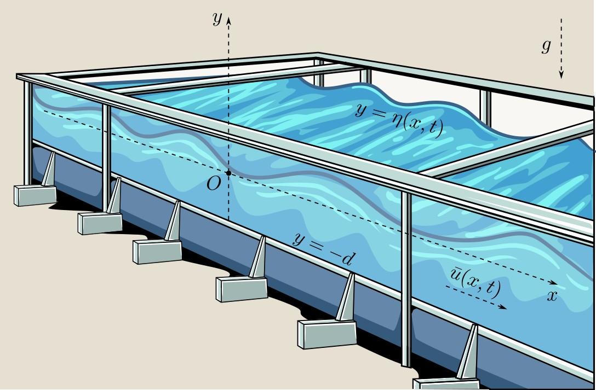

# 1DWaveTank: A Finite Volume Numerical Wave Tank



## Overview

`1DWaveTank` is a MATLAB-based numerical laboratory designed for simulating and analyzing long wave phenomena in one dimension. It serves as a flexible framework for implementing, testing, and comparing various mathematical models (both dispersive and non-dispersive) and numerical schemes, primarily focusing on the finite volume method.

The core philosophy is to provide a **modular**, **usable**, and **extensible** platform where researchers and students can easily experiment with different physical setups, numerical algorithms, and boundary conditions related to shallow water wave dynamics. While performance is considered, the primary focus is on clarity, usability, and ease of extension rather than achieving the absolute fastest implementation.

## Authors and Contributors

This project was initiated and is maintained by:

*   **Dr. Denys Dutykh**
    *   *Mathematics Department, Khalifa University of Science and Technology, Abu Dhabi, UAE*

### Key Contributors

*   **Dr. Francesco Carbone**
    *   *University of Calabria, Italy*
    *   Contributed the multilayer nonlinear shallow water equations implementation for atmospheric modeling

*   **Prof. Mehmet ERSOY**
    *   *SEATECH - École d'Ingénieurs de l'Université de Toulon, IMATH - Institut de Mathématiques de Toulon, France*
    *   Contributed the kinetic flux routine based on his original Fortran code

## Project Structure

The codebase is organized using MATLAB packages (directories starting with `+`) to promote modularity and clarity:

*   [`+cfg`](./+cfg/): Configuration files ([`simulation_config.m`](./+cfg/simulation_config.m), [`default_config.m`](./+cfg/default_config.m)). Defines simulation parameters, physical setup, numerical choices, and run control. All main scripts and configuration files are now extensively commented for clarity.
*   [`+core`](./+core/): Core solver components ([`solver.m`](./+core/solver.m), [`rhs_*.m`](./+core/), utils). Contains the main time-stepping logic and the functions defining the right-hand side (RHS) of the governing equations.
*   [`+flux`](./+flux/): Numerical flux functions (e.g., `HLLC.m`, `Rusanov.m`). Crucial for calculating the interaction between adjacent cells.
*   **[`+friction`](./+friction/)**: Friction model implementations (e.g., `no_friction.m`, `chezy.m`). Defines different bottom friction formulations for the momentum source term.
*   **[`+reconstruct`](./+reconstruct/)**: High-order reconstruction methods (e.g., `muscl.m`, `weno5.m`, `ppm.m`, `mp5.m`). Implements methods to increase spatial accuracy, including both component-wise and characteristic-based approaches for MUSCL, PPM, and MP5. See documentation for configuration details.
*   **[`+bc`](./+bc/)**: Boundary condition implementations (e.g., `wall.m`, `open.m`, `generating.m`). The generating BC now fills only the outermost ghost cell using Riemann invariants, with constant extrapolation for additional ghost cells when needed.
*   **[`+ic`](./+ic/)**: Initial condition setups (e.g., `lake_at_rest.m`, `gaussian_bump.m`, `solitary_wave.m`). Defines the initial state (water depth `H`, discharge `HU`). `lake_at_rest` now supports flat free surfaces over variable bathymetry.
*   **[`+time`](./+time/)**: Time integration schemes (e.g., `integrate_euler_adaptive.m`). Contains different methods for advancing the solution in time.
*   **[`+vis`](./+vis/)**: Visualization tools (`plot_state.m`). Functions for plotting the simulation results.
*   **`run_simulation.m`**: The main script to configure, run, and visualize a simulation. Now features comprehensive comments and improved documentation throughout the workflow.
*   **[`+bathy`](./+bathy/)**: Bathymetry definitions. Defines the bottom elevation.

## Features

- **Well-Balanced High-Order Scheme:**
  - The function [`+core/rhs_nsw_high_order.m`](./+core/rhs_nsw_high_order.m) implements a well-balanced high-order finite volume scheme for the 1D Nonlinear Shallow Water equations, following Audusse et al. (2004) and related literature. This includes:
    - **Hydrostatic reconstruction** at cell interfaces, ensuring exact preservation of "lake at rest" steady states over variable bathymetry.
    - **Centered source term** discretization, consistent with the hydrostatic interface treatment, for improved stability and balance.
    - Modular support for high-order reconstruction methods: MUSCL (with limiters), PPM (3rd order), MP5 (5th order), CWENO, THINC, WENO5, with both component-wise and characteristic-based options (see configuration below).
    - Robust handling of dry states, ghost cells, and boundary conditions.
    - For stationary/well-balanced tests, use a high-order scheme (e.g., MUSCL+van Leer, PPM, MP5) and set MATLAB ODE solver tolerances (AbsTol/RelTol) to 1e-9 or tighter for machine-precision accuracy.
    - The `lake_at_rest` initial condition is now truly well-balanced for arbitrary bathymetry.

- **Performance Optimizations (NEW):**
  - **MUSCL Reconstruction Acceleration:** The MUSCL reconstruction algorithm has been optimized by vectorizing the inner loop, resulting in significant performance improvements for large-scale simulations.
  - The van Albada limiter function now correctly receives the configuration (`cfg`) parameter, ensuring proper handling of epsilon values for near-zero gradients.

- **New Test Cases (NEW):**
  - **Sloping Beach Simulation:** A new bathymetry function `sloping_beach.m` has been added that creates a flat bottom for the first 2/3 of the channel followed by a sloping beach. This enables simulation of wave runup and interaction with a beach.
  - The visualization has been enhanced to correctly display the free surface at y=0 and the bottom at y=-1 for the flat region, with proper positioning of boundary markers at the bottom of the tank.
  - See the function header in `rhs_nsw_high_order.m` for authorship and literature references.
  - **Configuration:**
    - Select the reconstruction method and mode (component-wise or characteristic) via `cfg.reconstruct` fields (see below and User Guide).
    - For characteristic-based schemes, set `cfg.reconstruct.characteristic = true` (MUSCL, WENO5, THINC), `cfg.reconstruct.ppm_mode = 'characteristic'` (PPM), or `cfg.reconstruct.mp5_mode = 'characteristic'` (MP5).
  - Usage and further details: see the [User Guide](./UserGuide.md) and in-code documentation.

- **Flexible High-Order Reconstruction:**
  - Supports MUSCL (with various limiters), WENO5, PPM (3rd order), MP5 (5th order), CWENO, and THINC methods.
  - MUSCL, PPM, and MP5 now support both component-wise and characteristic-based reconstruction. Selection is controlled by `cfg.reconstruct.characteristic` (for MUSCL), `cfg.reconstruct.ppm_mode`, and `cfg.reconstruct.mp5_mode`.
  - MP5 (Suresh & Huynh, 1997) is implemented, requires `ng=3` ghost cells, and defaults to characteristic mode. The dam_break test case is configured to use 5th-order characteristic MP5 with RK4 time stepping.
  - Easy switching between schemes and limiters in the configuration file.

- **Tight ODE Solver Tolerances:**
  - For stationary and well-balanced tests, the configuration supports setting AbsTol/RelTol for MATLAB ODE solvers, allowing users to resolve residuals to machine precision.

*   Non-linear Shallow Water (NSW) equations solver
*   1st Order Finite Volume Method framework
*   **Friction Models:** Modular bottom friction implementations in [`+friction/`](./+friction/) including:
    *   No Friction (default) (`no_friction.m`)
    *   Chézy Friction (`chezy.m`)
    *   Manning Friction (`manning.m`)
    *   Darcy-Weisbach Friction (`darcy_weisbach.m`) with optional Colebrook-White formula (`colebrook_white.m`)
    *   Extensible framework for adding custom friction models
*   **Numerical Fluxes:** Modular functions available in [`+flux/`](./+flux/) including:
    *   FVCF, HLL, HLLC, Rusanov, Roe, Osher-Solomon, Steger-Warming, FORCE, AUSM+, AUSMDV, Lax-Friedrichs, HLLE, SLAU, CentralUpwind, PVM, Kinetic
*   **Time Integration:** Adaptive time stepping based on a CFL condition or embedded error estimate available in [`+time/`](./+time/) for:
    *   Forward Euler (`integrate_euler_adaptive.m`)
    *   SSP(2,2) (`integrate_ssp2_adaptive.m`)
    *   SSP(3,3) (`integrate_ssp3_adaptive.m`)
    *   Explicit RK4 (`integrate_rk4_adaptive.m`)
    *   Bogacki-Shampine 3(2) embedded RK (`integrate_bogacki_shampine.m`)
    *   Dormand-Prince 5(4) embedded RK (`integrate_dopri54_adaptive.m`)
    *   Adams-Bashforth 2nd Order (AB2) (`integrate_ab2_adaptive.m`)
    *   Standardized output format (`[sol_out, t_out, stats]`) for custom adaptive steppers.
*   **MATLAB ODE Solvers:** Wrapper (`integrate_matlab_ode.m`) for standard solvers (e.g., `ode45`, `ode113`, `ode23`) with:
    *   Configurable solver choice (`cfg.time.matlab_solver`)
    *   Optional custom `odeset` options (`cfg.time.ode_options`)
*   **Boundary Conditions:** Implementations in [`+bc/`](./+bc/) including:
    *   Solid Wall (`wall.m`)
    *   Wave Generating (`generating.m`)
    *   Periodic (`periodic.m`)
*   **Initial Conditions:** Setups in [`+ic/`](./+ic/) including:
    *   Lake at Rest (`lake_at_rest.m`): Flat free surface at `z = cfg.h0` over the defined bathymetry, zero initial velocity.
    *   Gaussian Bump (`gaussian_bump.m`)
    *   Solitary Wave (`solitary_wave.m`)
    *   Dam Break (`dam_break.m`)
    *   Dry Dam Break (`dry_dam_break.m`)
*   **High-Order Reconstruction:** Second-order accuracy using various methods:
    *   ENO2 (Essentially Non-Oscillatory) reconstruction for 2nd order accuracy (`+reconstruct/eno2.m`).
    *   WENO5 (Weighted Essentially Non-Oscillatory) reconstruction for superior accuracy in both smooth regions and near discontinuities (`+reconstruct/weno5.m`).
    *   MUSCL (Monotone Upstream-centered Schemes for Conservation Laws) with Minmod limiter for 2nd order accuracy (`+reconstruct/muscl.m`).
    *   PPM (Piecewise Parabolic Method) for 3rd order accuracy (`+reconstruct/ppm.m`).
    *   MP5 (Monotonicity Preserving 5th Order) reconstruction (`+reconstruct/mp5.m`) with both component-wise and characteristic-based options for superior high-order accuracy.
    *   **CWENO (Central Weighted Essentially Non-Oscillatory):** High-order method using a central optimal stencil and sub-stencils (`+reconstruct/cweno.m`). Achieves high-order accuracy with fewer points than traditional WENO, improves accuracy at smooth extrema, and preserves non-oscillatory behavior near discontinuities. Supports both component-wise and characteristic-based reconstruction (the latter uses Roe-averaged eigenvectors).
    *   **THINC (Tangent of Hyperbola for Interface Capturing):** Modern interface-capturing method supporting both component-wise and characteristic-based reconstruction (`+reconstruct/thinc.m`). Characteristic mode uses Roe-averaged eigenvector decomposition for improved discontinuity resolution. Robust boundary handling is implemented via stencil clamping.
    *   Choice of slope limiters for MUSCL (Minmod, Superbee, OSPRE, Van Leer, Van Albada) in [`+reconstruct/+limiters/`](./+reconstruct/+limiters/).
*   Configurable domain, mesh, and simulation parameters
*   Modular, extensible configuration system
*   Visualization tools for water surface, velocity, and bathymetry
*   Output control: results saving can be toggled via configuration
*   MATLAB package-based project structure for clarity and extensibility
*   Example experiment setups for rapid testing

## Getting Started

1.  **Clone the Repository:**
    ```bash
    git clone https://github.com/dutykh/1DWaveTank 1DWaveTank
    cd 1DWaveTank
    ```
2.  **Configure Simulation:**
    *   Open [`+cfg/simulation_config.m`](./+cfg/simulation_config.m).
    *   **Select Experiment Setup:** Choose a pre-defined setup by uncommenting the corresponding `case '[setup_name]'` block (e.g., `flat_wave_gen`, `periodic_solitary`, `dam_break`). These setups define specific combinations of initial conditions, boundary conditions, and physical parameters.
    *   **Customize Parameters:** Modify parameters directly within `simulation_config.m` *after* loading the default and experiment setups. Key areas include:
        *   **Domain & Mesh:** `cfg.domain.xmin`, `cfg.domain.xmax`, `cfg.mesh.N`
        *   **Physics:** `cfg.phys.g`, `cfg.phys.friction_model`, `cfg.phys.dry_tolerance`
        *   **Time Integration:** `cfg.timeStepper`, `cfg.time.cfl`, `cfg.tEnd`
        *   **Boundary Conditions:** `cfg.bc.left.handle`, `cfg.bc.right.handle`
        *   **Reconstruction (for high-order):** `cfg.reconstruct.handle` (e.g., `@reconstruct.muscl_characteristic`), `cfg.reconstruct.limiter` (e.g., `@reconstruct.limiters.mc`).
    *   See the **Configuration Details** section below for more information.
3.  **Run Simulation:**
    *   Execute the main script from the MATLAB command window:
        ```matlab
        run_simulation
        ```
4.  **Observe Results:** The script will output simulation progress to the console and display an animation of the wave tank evolution (if `cfg.vis.do_vis = true`). Solution data (`sol_out`, `t_out`) and statistics (`stats`) are returned by `core.solver`.

## Configuration Details (`+cfg/simulation_config.m`)

Configuration is handled hierarchically:

1.  **Defaults:** [`+cfg/default_config.m`](./+cfg/default_config.m) provides baseline values for all parameters.
2.  **Experiment Setup:** A function within `+cfg/experiment_setups/` (e.g., [`flat_wave_gen.m`](./+cfg/experiment_setups/flat_wave_gen.m)) is called from `simulation_config.m`. This function modifies the default `cfg` structure to define a specific scenario (IC, BCs, specific parameters).
3.  **User Overrides:** Direct assignments within `simulation_config.m` *after* calling the experiment setup function allow fine-tuning or overriding specific parameters for the current run.

Key `cfg` fields to customize:

*   `cfg.mesh`: Domain (`xmin`, `xmax`) and discretization (`N`, `dx`).
*   `cfg.phys`: Physical constants (`g`) and friction settings:
    *   `friction_model`: Function handle to the selected friction model (e.g., `@friction.no_friction`, or use `friction.friction_selector('chezy')`, `friction.friction_selector('manning')`, or `friction.friction_selector('darcy_weisbach')`).
    *   `chezy_C`: Chézy coefficient when using the Chézy friction model (typical values: 30-90 m^(1/2)/s).
    *   `manning_n`: Manning's roughness coefficient when using the Manning friction model (typical values: 0.01-0.05 s/m^(1/3)).
    *   `darcy_f`: Darcy friction factor when using the Darcy-Weisbach model (typical values: 0.01-0.05).
    *   `f_calculation`: Method to calculate friction factor ('constant' or 'colebrook_white').
    *   `ks`: Equivalent sand roughness height [m] for Colebrook-White formula.
    *   `kinematic_viscosity`: Kinematic viscosity of water [m²/s] for Colebrook-White formula.
    *   `dry_tolerance`: Water depth threshold below which a cell is considered dry [m].
*   `cfg.param`: Model-specific parameters (e.g., `H0` for still water depth).
*   `cfg.time`: Time integration settings:
    *   `T`: Final simulation time.Finite volume A num
    *   `CFL`: Courant-Friedrichs-Lewy number for adaptive steppers.
    *   `integrator`: Function handle (`@time...`) for the chosen time stepper.
    *   `matlab_solver`: String name (e.g., `'ode45'`) if using the MATLAB ODE wrapper.
    *   `ode_options`: Optional `odeset` structure for MATLAB solvers.
*   `cfg.numFlux`: Function handle (`@flux...`) for the numerical flux calculation.
*   `cfg.icHandle`: Function handle (`@ic...`) for the initial condition.
*   `cfg.bc`: Structure containing boundary condition settings:
    *   `cfg.bc.left.handle`, `cfg.bc.right.handle`: Function handles (`@bc...`).
    *   `cfg.bc.left.param`, `cfg.bc.right.param`: Structures holding parameters specific to the chosen BC functions (e.g., amplitude `a` and period `T` for `@bc.generating`).
*   `cfg.vis`: Visualization settings:
    *   `plot_state_handle`: Function handle for the plotting function.
    *   `dt_plot`: Time interval between plot updates.
*   `cfg.output`: Output settings (e.g., saving results).
*   `cfg.reconstruct`: Settings for high-order reconstruction (used by `rhs_nsw_high_order`):
    *   `method`: String name of the reconstruction method (e.g., 'muscl', 'muscl_characteristic', 'ppm', 'mp5').
    *   `handle`: Function handle to the reconstruction implementation (e.g., `@reconstruct.muscl`).
    *   `order`: Order of reconstruction (currently supports `2`, `3`, `5`).
    *   `limiter`: Function handle to the slope limiter (e.g., `@reconstruct.limiters.minmod`).
    *   `characteristic`: Boolean, Use characteristic reconstruction for MUSCL/WENO5 (default: false).
    *   `ppm_mode`: String, 'component' or 'characteristic' for PPM (default: 'component').
    *   `mp5_mode`: String, 'component' or 'characteristic' for MP5 (default: 'characteristic').

## Extending the Solver

The package structure makes adding new components straightforward:

1.  **New Numerical Flux (`+flux`)**:
    *   Example: The **Kinetic** flux (`Kinetic.m`) is based on the original Fortran code by Prof. Mehmet ERSOY (Université de Toulon, IMATH). See header of `+flux/Kinetic.m` for details.
    *   Create a new `.m` file in the [`+flux/`](./+flux/) directory (e.g., `my_new_flux.m`).
    *   Implement your flux function with the signature: `F = my_new_flux(wL, wR, cfg)`
        *   `wL`, `wR`: State vectors [H; HU] to the left and right of the interface.
        *   `cfg`: Configuration structure (can be used for parameters like `g`).
        *   `F`: Returned numerical flux vector [Flux_H; Flux_HU].
    *   Select your flux in `simulation_config.m`: `cfg.numFlux = @flux.my_new_flux;`

2.  **New Time Integrator (`+time`)**:
    *   Create a new `.m` file in the [`+time/`](./+time/) directory (e.g., `integrate_my_scheme.m`).
    *   Implement your integrator. Aim for the standard output signature for consistency: `[sol_out, t_out, stats] = integrate_my_scheme(rhs_func, tspan, w0, cfg)`
        *   `rhs_func`: Function handle to the RHS evaluation function (provided by `core.solver`).
        *   `tspan`: Vector of requested output times.
        *   `w0`: Initial condition vector (flattened).
        *   `cfg`: Configuration structure.
        *   `sol_out`: Solution matrix (rows are time points, columns are state variables).
        *   `t_out`: Vector of actual output times.
        *   `stats`: Structure with solver statistics (e.g., `nsteps`, `nfevals`).
    *   Select your integrator in `simulation_config.m`: `cfg.time.integrator = @time.integrate_my_scheme;`

3.  **New Boundary Condition (`+bc`)**:
    *   Create a new `.m` file in the [`+bc/`](./+bc/) directory (e.g., `my_boundary.m`).
    *   Implement your BC function with the signature: `w_padded = my_boundary(w_padded, t, side, cfg, num_ghost_cells)`
        *   `w_padded`: State array including ghost cells.
        *   `t`: Current time.
        *   `side`: String ('left' or 'right').
        *   `cfg`: Configuration structure (can hold BC-specific parameters in `cfg.bc.(side).param`).
        *   `num_ghost_cells`: Number of ghost cells to fill.
        *   The function should modify the appropriate ghost cell rows in `w_padded` and return the modified array.
    *   Select your BC in `simulation_config.m` (or an experiment setup): `cfg.bc.left.handle = @bc.my_boundary;` (and potentially set parameters in `cfg.bc.left.param`).

4.  **New Initial Condition (`+ic`)**:
    *   Create a new `.m` file in the [`+ic/`](./+ic/) directory (e.g., `my_initial_state.m`).
    *   Implement your IC function with the signature: `w0 = my_initial_state(cfg)`
        *   `cfg`: Configuration structure (contains mesh info like `cfg.mesh.xc`, bathymetry handle `cfg.bathyHandle`, etc.).
        *   `w0`: Returned initial state vector [H; HU] (N x 2 array or flattened 2N x 1).
    *   Select your IC in `simulation_config.m` (or an experiment setup): `cfg.icHandle = @ic.my_initial_state;`

5.  **New Bathymetry (`+bathy`)**:
    *   Create a new `.m` file in the [`+bathy/`](./+bathy/) directory (e.g., `my_bathymetry.m`).
    *   Implement your bathymetry function with the signature: `h = my_bathymetry(x, cfg)`
        *   `x`: Vector of spatial coordinates.
        *   `cfg`: Configuration structure.
        *   `h`: Returned vector of water depths at each `x`.
    *   Select your bathymetry in `simulation_config.m`: `cfg.bathyHandle = @bathy.my_bathymetry;`

6.  **New Friction Model (`+friction`)**:
    *   Create a new `.m` file in the [`+friction/`](./+friction/) directory (e.g., `manning.m`).
    *   Implement your friction model with the signature: `friction_term = manning(H, HU, g, cfg)`
        *   `H`: Water depth at each cell [m].
        *   `HU`: Discharge at each cell [m²/s].
        *   `g`: Gravitational acceleration [m/s²].
        *   `cfg`: Configuration structure (can hold friction-specific parameters in `cfg.phys`).
        *   The function should return a vector of friction source terms for the momentum equation.
    *   Add your model to the `friction_selector.m` function to enable selection by name.
    *   Select your friction model in `simulation_config.m`: `config.phys.friction_model = friction.friction_selector('manning');`

7.  **New Reconstruction Method (`+reconstruct`)**:
    *   Create a new `.m` file in [`+reconstruct/`](./+reconstruct/) (e.g., `my_reconstruction.m`).
    *   Implement the reconstruction function with the signature: `[wL_interface, wR_interface] = my_reconstruction(w_padded, cfg)`
        *   `w_padded`: Padded state vector [H; HU].
        *   `cfg`: Configuration structure.
        *   `wL_interface`, `wR_interface`: Reconstructed states at the left/right sides of each cell interface.
    *   This function will be called by `core.rhs_nsw_high_order.m`.
    *   Select your method in `simulation_config.m`: `cfg.reconstruct.handle = @reconstruct.my_reconstruction;` and update `cfg.reconstruct.method` and `cfg.model = @core.rhs_nsw_high_order;`.

8.  **New Slope Limiter (`+reconstruct/+limiters`)**:
    *   Create a new `.m` file in [`+reconstruct/+limiters/`](./+reconstruct/+limiters/) (e.g., `my_limiter.m`).
    *   Implement the limiter function with the signature: `slope = my_limiter(delta_minus, delta_plus)`
        *   `delta_minus`, `delta_plus`: Differences between adjacent cell values (or characteristic variables).
        *   `slope`: The limited slope.
    *   Select your limiter in `simulation_config.m` when using a MUSCL scheme: `cfg.reconstruct.limiter = @reconstruct.limiters.my_limiter;`.

## Contributing

Contributions are highly welcome! This project aims to be a collaborative environment for exploring finite volume methods for wave modeling.

*   If you add a new feature or fix a bug, please document your changes and, if possible, provide a validation or unit test.
*   New tests and beta testers are especially welcome—if you find issues or have suggestions, please open an issue or submit a pull request.
*   Please follow the existing MATLAB package structure for any new code.

## License

This project is licensed under the **GNU General Public License v3.0**.

*   Copyright (C) 2025 Dr. Denys Dutykh
*   See the `LICENSE` file for the full license text.

This program is free software: you can redistribute it and/or modify
it under the terms of the GNU General Public License as published by
the Free Software Foundation, either version 3 of the License, or
(at your option) any later version.

This program is distributed in the hope that it will be useful,
but WITHOUT ANY WARRANTY; without even the implied warranty of
MERCHANTABILITY or FITNESS FOR A PARTICULAR PURPOSE.  See the
GNU General Public License for more details.

You should have received a copy of the GNU General Public License
along with this program. If not, see <https://www.gnu.org/licenses/>.

*   Main author: Dr. Denys Dutykh (Khalifa University of Science and Technology, Abu Dhabi, UAE)
*   Please cite appropriately if you use this code for research or teaching.

**Contributors:**
- Prof. Mehmet ERSOY (SEATECH - École d'Ingénieurs de l'Université de Toulon, IMATH - Institut de Mathématiques de Toulon, France). The kinetic flux routine (+flux/Kinetic.m) is based on his original Fortran code and we gratefully acknowledge his scientific input and generosity in sharing this algorithm. Contact: http://ersoy.univ-tln.fr/
- Dr. Francesco Carbone (National Research Council - Institute of Atmospheric Pollution Research, C/o University of Calabria, Rende, Italy). We gratefully acknowledge his precious suggestions and for pointing out some bugs in the code.